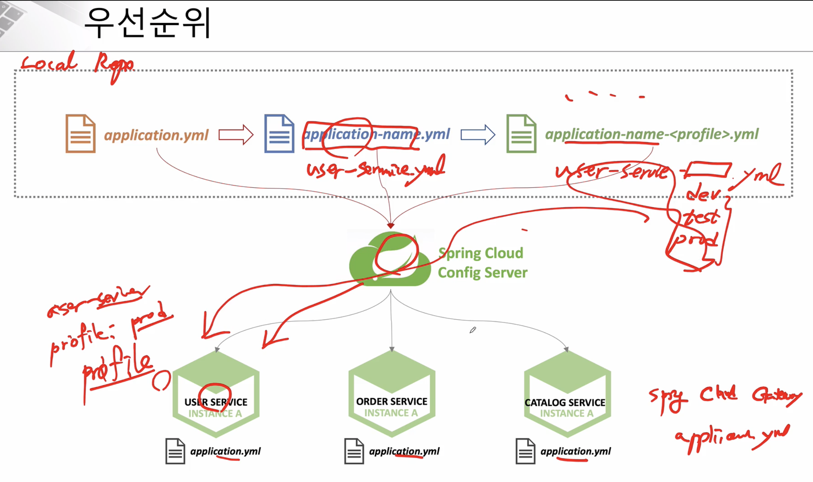
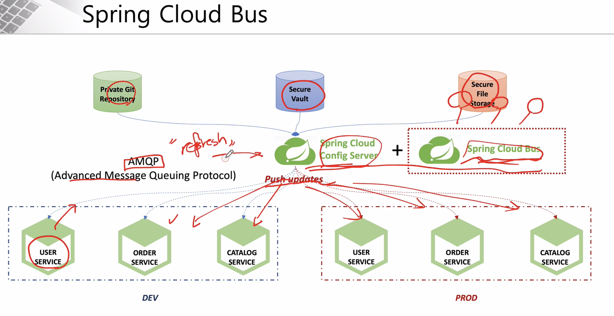

# Spring Cloud

## Config Service

Changed configuration values

- Server(Service) reboot

- `Actuator` refresh
  - Spring Boot Actuator
    - Application 상태, 모니터링 
    - Metric 수집을 위한 Http End point 제공

- `Spring cloud bus` use
  - 분산 시스템의 노드(microservice)를 경량 메시지 브로커(RabbitMQ)와 연결
  - 상태 및 구성에 대한 변경 사항을 연결된 노드에게 전달(Broadcast)

application yaml 파일 우선순위

1. application.yml 파일

2. application-{name}.yml 파일
   - eg. application-user-service.yml

3. application-{name}-{profile}.yml 파일
   - eg. application-user-service-dev.yml

Spring Cloud Bus

- (`Spring Cloud Config Server` + `Spring Cloud Bus`) 를 사용하여 각 서비스에게 한번에 Configuration 정보를 변경 (with RabbitMQ)

## Troubleshooting

__[SESSION 7. Configuration Service]__ Spring Cloud Config - 프로젝트 생성

(trouble) 서비스 실행 후 `http://127.0.0.1:8888/ecommerce/default` 페이지 404 에러 발생

(shooting) spring-cloud-config-server 에서 기본적으로 git 의 mater branch 에서 정보를 읽어온다. 따라서 자신이 커밋한 branch 명을 명시해줘야한다.

- application.yml 파일에 `spring.cloud.config.server.git.default-label: main` 추가

---