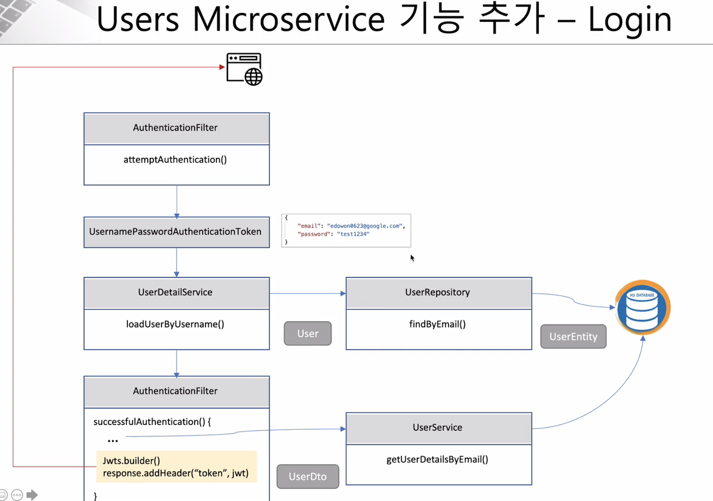

# Spring Cloud

## Nflix Eureka Client

### 실행 방법

maven 포트 설정 실행 방법

```bash
$ mvn spring-boot:run -Dspring-boot.run.jvmArguments='-Dserver.port=9003'
```

### Spring Security

- Authentication + Authorization

- 작업 순서 :
  - Step 1: 애플리케이션에 __spring security jar__ 을 Dependency에 추가
  - Step 2: __WebSecurityConfigurerAdapter__ 를 상속받는 __Security Configuration__ 클래스 생성
  - Step 3: Security Configuration 클래스에 __@EnableWebSecurity__ 추가
  - Step 4: Authentication → __configure(AuthenticationManagerBuilder auth)__ 메서드를 재정의
  - Step 5: Password encode를 위한 __BCryptPasswordEncoder__ 빈 정의
  - Step 6: Authorization → __configure(HttpSecurity http)__ 메서드를 재정의

### 로그인 기능

일반적인 로그인 처리 순서

1. Query
```roomsql
SELECT PASSWORD FROM USERS
WHERE USERNAME = ?
```

2. 값이 존재하는지 확인.
  - 만약 존재하지 않는다면, `Not Exist` Message 출력
  - 만약 존재한다면, Query 에서 구한 PASSWORD 와 입력 받은 PASSWORD 를 비교

User Microservice 기능 추가 - Login



- AuthenticationFilter
  - `attemptAuthentication()` : 로그인 처리
  - UsernamePasswordAuthenticationToken : 사용자 아이디(email), 비밀번호로 로그인 검증

- UserDetailService
  - `UserService` 에서 `UserDetailsService` 를 상속
  - `loadUserByUsername()` : 우리가 만든 사용자 클래스에서 Spring Security 의 `org.springframework.security.core.userdetails.User` 를 리턴

- AuthenticationFilter
  - `successfulAuthentication()` : 로그인 성공 처리
  - 정상적으로 로그인이 되었다면, JWT(Json Web Token) 생성

전통적인 인증 서비스


- 서버 내부에서 세션/쿠키를 통해 관리

Token 인증 서비스


- JWT 기술을 주로 사용
- 사용자로부터 인증에 관한 정보를 토큰으로 주고 받음

JWT 인증 서비스


- Token 정보를 스토리지(DB) 에 관리하여 여러 시스템에서 __인증__ 처리가 가능